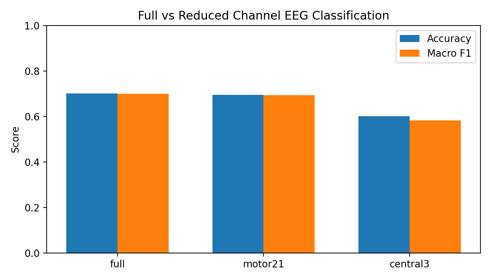
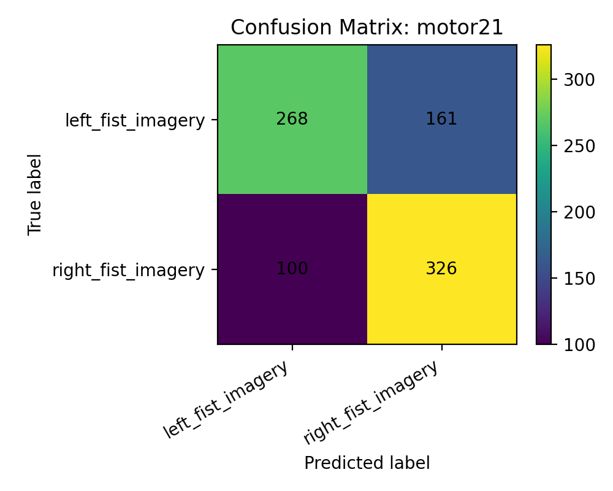
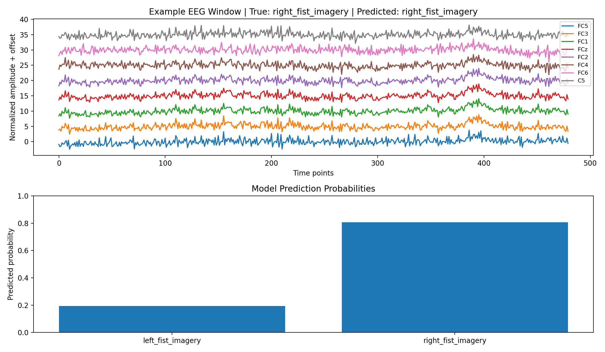

# EEG Motor Imagery Classification: Full vs Reduced Channel Sets

## Project Purpose

This project investigates whether a reduced number of EEG channels can still support brain-computer interface (BCI) classification. In EEG-based BCIs, a model can be trained to predict a user’s intended movement from brain signals. One common task is motor imagery classification, where the subject imagines moving the left or right hand, and the model predicts which movement was imagined.

The main question of this project is:

**Can a reduced set of motor-area EEG channels perform similarly to a full 64-channel EEG setup for left vs. right motor imagery classification?**

This question is important because full EEG systems can provide rich spatial information, but they are less practical, less portable, and more difficult to set up. If a smaller set of channels performs similarly, that would suggest that reduced EEG systems may still preserve useful information for BCI-style classification.

## Dataset

This project uses the **PhysioNet EEG Motor Movement/Imagery Dataset**. The dataset contains EEG recordings collected using the BCI2000 system. The original dataset includes 64-channel EEG recordings from multiple subjects performing or imagining different motor tasks.

For this project, I focused on the **left vs. right fist motor imagery task**. I used the imagined movement runs:

- `R04`
- `R08`
- `R12`

For these runs, the event annotations are:

- `T1` = left fist imagery
- `T2` = right fist imagery
- `T0` = rest

The rest class was excluded because the goal was binary classification between left and right motor imagery.

## How the Dataset Was Created

The original EDF EEG recordings were converted into event-based samples. Instead of treating an entire EDF file as one sample, the dataset class cuts windows around each `T1` or `T2` event.

The preprocessing pipeline is:

1. Load EDF EEG files with MNE.
2. Select motor imagery runs `R04`, `R08`, and `R12`.
3. Extract only `T1` and `T2` events.
4. Cut a 3-second EEG window from `0.5s` to `3.5s` after each event onset.
5. Resample recordings to 160 Hz when needed.
6. Apply 1–40 Hz band-pass filtering.
7. Select one of three channel sets:
   - `full`: all 64 EEG channels
   - `motor21`: 21 motor-area channels
   - `central3`: C3, Cz, and C4

8. Normalize each channel within each sample.
9. Return each sample as a tensor with shape `[channels, time_points]`.

The dataset is implemented in:

```text
src/eeg_project/dataset.py
```

The dataset uses a subject-wise train/validation/test split. This is important because random window-level splitting could allow data from the same subject to appear in both training and testing, which could overestimate performance. A subject-wise split is more realistic because the model is evaluated on subjects not seen during training.

## Model

The model is a simple 1D convolutional neural network implemented in:

```text
src/eeg_project/models.py
```

I selected a 1D CNN because EEG is time-series data. The convolutional layers can learn local temporal patterns in the EEG signal while keeping the model simpler and easier to train than a recurrent or transformer-based model.

The model takes input with shape:

```text
[batch_size, channels, time_points]
```

The number of input channels changes depending on the channel condition:

- 64 channels for `full`
- 21 channels for `motor21`
- 3 channels for `central3`

The same model architecture was used across all channel sets, except for the input channel size. This makes the comparison more fair because the main experimental difference is the amount of EEG channel information available to the model.

## Training Instructions

First, install the project in editable mode:

```bash
python -m pip install -e .
```

To train all three channel-set models, run:

```bash
python scripts/train_models.py --data-dir data --epochs 20 --seed 42
```

This trains models for:

```text
full
motor21
central3
```

The training script saves model checkpoints, result JSON files, confusion matrices, and a summary CSV file in the `results/` directory.

The training script is located at:

```text
scripts/train_models.py
```

## Evaluation Metrics

I used the following evaluation metrics:

1. **Accuracy**
   Accuracy measures the overall proportion of correct predictions.

2. **Macro F1 Score**
   Macro F1 averages F1 score across both classes. This is useful because it shows whether the model performs reasonably across both left and right imagery classes, instead of only doing well on one class.

3. **Confusion Matrix**
   The confusion matrix shows which classes are correctly predicted and which classes are confused. This is important because accuracy alone does not show whether the model makes balanced predictions across left and right motor imagery.

The evaluation notebook is located at:

```text
notebooks/evaluation.ipynb
```

## Results

The final test results with seed 42 were:

| Channel set | Number of channels | Test Accuracy | Test Macro F1 | Best Validation Macro F1 |
| ----------- | -----------------: | ------------: | ------------: | -----------------------: |
| Full        |                 64 |        0.7006 |        0.6993 |                   0.7039 |
| Motor21     |                 21 |        0.6947 |        0.6933 |                   0.6950 |
| Central3    |                  3 |        0.6012 |        0.5831 |                   0.5961 |

The full 64-channel model and the reduced motor21 model performed very similarly. The full model reached about 70.1% accuracy, while the motor21 model reached about 69.5% accuracy. This suggests that the motor-area reduced channel set preserved most of the useful information for this left vs. right motor imagery classification task.

The central3 model performed worse, with about 60.1% accuracy and 58.3% macro F1. This suggests that reducing the EEG input too aggressively can remove useful spatial information.

### Channel Comparison



### Confusion Matrix

The motor21 confusion matrix shows that the model performed better for right-fist imagery than left-fist imagery.



For the motor21 model:

- Left fist imagery: 268 correct, 161 predicted as right
- Right fist imagery: 326 correct, 100 predicted as left

This suggests that the model was more confident or more successful when identifying right-fist imagery. One possible explanation is subject-level variability, such as handedness or more consistent right-hand motor imagery patterns. However, the current project does not directly test handedness, so this should be treated as a possible interpretation rather than a confirmed conclusion.

### Example Prediction Visualization

The evaluation notebook also shows an example EEG window and the model’s predicted probabilities.



In this example, the true label was right fist imagery, and the model also predicted right fist imagery with higher probability.

## Limitations and Discussion

This project worked reasonably well for the main goal. The most important result is that the reduced motor21 model performed very close to the full 64-channel model. This supports the idea that carefully selected motor-area EEG channels may be enough for basic left vs. right motor imagery classification.

However, there are several limitations. First, the model is relatively simple and only uses raw time-domain EEG windows. More advanced EEG features, such as frequency-band power or time-frequency representations, could improve performance. Second, the project uses basic preprocessing. More careful artifact rejection, such as removing eye blinks or muscle artifacts, could make the EEG signals cleaner. Third, the result is based on one subject-wise split with seed 42. Additional random seeds or cross-validation would make the conclusion more stable.

Another limitation is that the model performs better on right-fist imagery than left-fist imagery. This class-level difference may reflect patterns in the dataset or differences across subjects, but the model does not directly explain why this happens.

Overall, the project shows that channel selection matters for EEG classification. A reduced motor-area channel set can preserve performance close to the full EEG setup, but reducing the channels too much can hurt classification. This suggests that reduced-channel EEG systems may be useful for more practical BCI applications, but the channel selection needs to be done carefully.

## Repository Structure

```text
eeg-project/
├── README.md
├── pyproject.toml
├── scripts/
│   └── train_models.py
├── src/
│   └── eeg_project/
│       ├── dataset.py
│       ├── models.py
│       └── __init__.py
├── notebooks/
│   ├── data_demo.ipynb
│   └── evaluation.ipynb
└── results/
    ├── channel_comparison_seed42.csv
    ├── eeg_full_seed42.json
    ├── eeg_motor21_seed42.json
    ├── eeg_central3_seed42.json
    └── figures/
```

## Data and Weights

The original dataset can be obtained from the PhysioNet EEG Motor Movement/Imagery Dataset. The raw EDF data files are not included in this GitHub repository because they are large.

Expected local data directory:

```text
data/
```

Pretrained model weights are stored on Talapas at:

```text
/projects/dsci410_510/sunnypark/eeg-project/results/eeg_full_seed42.pt
/projects/dsci410_510/sunnypark/eeg-project/results/eeg_motor21_seed42.pt
/projects/dsci410_510/sunnypark/eeg-project/results/eeg_central3_seed42.pt
```

The corresponding result files and figures are stored in the GitHub repository under:

```text
results/
results/figures/
```

## Reference

Schalk, G., McFarland, D. J., & Wolpaw, J. R. (2009). EEG Motor Movement/Imagery Dataset (Version 1.0.0) [Data set]. PhysioNet. https://doi.org/10.13026/C28G6P
